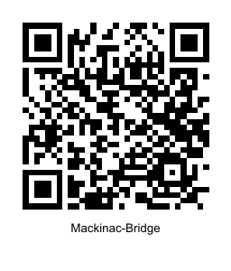

# QR Maker

If you need to generate a number of QR codes, say for signage, manually creating them could be tedious.  Typically you have a base URL, like your organization website, and then a series of pages under that base url.  QR Maker takes a base url, a list of sub-pages, and combines them into a series of png and svg files for each complete URL.

## Building

Assuming you have the go environment installed, check out this repository, or just download the source code. In the folder with the source code, run

    go build

You should get a working executable for your system.  If you want to make it available system wide, run

    go install

## Using qrmaker

Create a text file with the paths that codes need to be generated for, one per line.  For example, I need to make signs for the following pages in my online store:

* https://www.dowling.studio/shop/p/mackinac-bridge
* https://www.dowling.studio/shop/p/tombolo
* https://www.dowling.studio/shop/p/the-night-pond

The base url for all of these is `https://www.dowling.studio/shop/p`. In the text file `urls.txt`, I put the following:

    mackinac-bridge
    tombolo
    the-night-pond

Now I run the following command:

    qrmaker -base https://www.dowling.studio/shop/p -source urls.txt

I should now have output of the following files:

* mackinac-bridge.png
* mackinac-bridge.svg
* tombolo.png
* tombolo.svg
* the-night-pond.png
* the-night-pond.svg

Now these files can be used in whatever layout program you need to generate your signage.  Note that the png files are not embedded, so if you wish to use the SVG components with the names in your signage, you will need to move both the svg and the png files to the working directory for your signage.